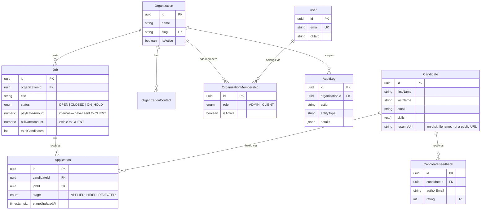

# Data model

TypeORM entities in `backend/src/entities/`, registered in
`config/data-source.ts`. In development, `synchronize: true` means the
schema is generated from these entities automatically on boot — there are
no migration files yet (`synchronize: false` and real migrations under
`src/migrations/` are expected before production; see
[data-source.ts](../../backend/src/config/data-source.ts)).

## Entity-relationship diagram

## Entities

### Organization
A client company SWFS recruits for. Has `Job`s, `OrganizationContact`s
(named points of contact), and `OrganizationMembership`s (which `User`s
belong to it and with what role). `slug` is unique and used by the seed
script / demo login mapping.

### User
A person who signs into the portal. Identity only — role is *not* a column
here; it lives on `OrganizationMembership` (a user's role is
organization-scoped, not global). `oktaId` links the account to an Okta
subject once they've signed in via SSO.

### OrganizationMembership
Join row: which `role` (`ADMIN` or `CLIENT`) a `User` holds at a given
`Organization`. Unique on `(organization, user)`.

### Job
An open (or closed) role a client is hiring for, owned by one
`Organization`. Two money columns, deliberately asymmetric:
- `payRateAmount` (`payRate`) — cost paid to the candidate/contractor.
  **SWFS-internal**, stripped from every response to a `CLIENT` user (see
  `jobController.scopeJobForRole` in
  [api-reference.md](api-reference.md#internal-fields-are-scoped-by-role)).
- `billRateAmount` (`billRate`) — rate charged to the client. Visible to
  everyone; it's the only rate a `CLIENT` sees.
- `totalCandidates` is a denormalized counter, incremented when a candidate
  is created against the job or linked to it later.

### Candidate
A person in the pipeline. **Has no organization of its own** — its only
relationship to a client is indirect, through the `Application`s (job
links) it has. This is why every candidate-repository read that needs to be
org-scoped for a `CLIENT` caller joins through `applications → job →
organization` rather than filtering on a column (see
`candidateRepository.findByOrganization` /
`isLinkedToOrganization`).
`resumeUrl`/`jdUrl`-style fields store the on-disk filename under
`backend/uploads/`, never a public URL — files are only ever served through
the authenticated download routes.

### Application
The `(candidate, job)` pair — one row per link, unique on that pair. Carries
`stage` (the pipeline position for that specific role:
`APPLIED → SCREENING → INTERVIEW → SHORTLISTED → OFFER → HIRED`, or
`REJECTED`) and `stageUpdatedAt`, which powers time-in-stage metrics. A
candidate linked to three different jobs has three `Application` rows, each
with its own independent stage.

### CandidateFeedback
A note (and optional 1–5 rating) left on a `Candidate` by a portal user
(`authorEmail`/`authorRole` are denormalized at write time, not a live FK to
`User`). The most recent rating also gets written to
`Candidate.clientRating` for quick display.

### AuditLog
Append-only record of a portal action, backing the Activity feed
(`activity.controller.ts`). Written by `auditLogService.log(user, action,
entityType, entityId, details)` after nearly every mutating controller
method. `organization` is nullable and `SET NULL` on delete, so a log
survives its organization being removed.

## Enums

Runtime value arrays for the domain unions, defined once in
[`entities/enums.ts`](../../backend/src/entities/enums.ts) and shared by the
`@Column({ type: 'enum' })` decorators and `types/index.ts`'s TypeScript
unions — keep these two in sync if a value is added:

| Enum | Values |
|---|---|
| `UserRole` | `ADMIN`, `CLIENT` |
| `CandidateStage` | `APPLIED`, `SCREENING`, `INTERVIEW`, `SHORTLISTED`, `OFFER`, `HIRED`, `REJECTED` |
| `CandidateSource` | `PORTAL`, `LINKEDIN` |
| `JobStatus` | `OPEN`, `CLOSED`, `ON_HOLD` |
| `WorkType` | `FULL_TIME`, `PART_TIME`, `CONTRACT`, `CONTRACT_TO_HIRE` |
| `PayrollType` | `THIRD_PARTY`, `IN_HOUSE` |

## API vs. entity shape

Controllers/repositories don't return raw TypeORM entities — the
`candidateRepository`'s `toDto()` (and equivalents elsewhere) flatten
relations into a friendlier shape, e.g. a `Candidate`'s `applications`
become `jobLinks: { jobId, jobTitle, stage, organizationId,
organizationName }[]`. When writing frontend types or new endpoints, check
the repository's DTO mapper, not just the entity file.
